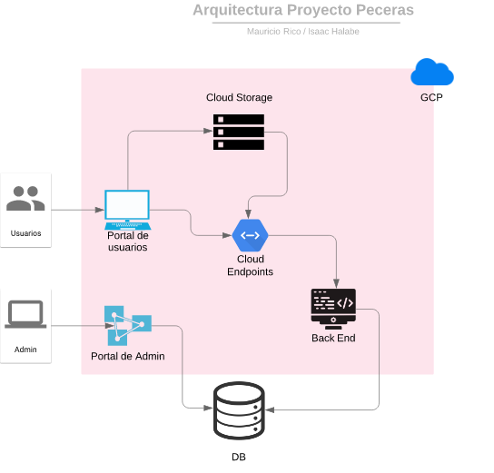

# Implementación de PecerasGratis en GCP
---
#### Materia: TC3059 Desarrollo de Aplicaciones en la Nube

##### Campus: Santa Fe

##### Integrantes:
1. Isaac Halabe Husny
2. Mauricio Rico Zavala

---
## 1. Aspectos generales

### 1.1 Requerimientos técnicos

A continuación se mencionan los requerimientos técnicos mínimos del proyecto, favor de tenerlos presente para que cumpla con todos.

* El equipo tiene la libertad de elegir las tecnologías de desarrollo a utilizar en el proyecto, sin embargo, debe tener presente que la solución final se deberá ejecutar en una de las siguientes plataformas en la nube: [Google Cloud Platform](https://cloud.google.com/?hl=es), [Amazon Web Services](https://aws.amazon.com/) o [Microsoft Azure](https://azure.microsoft.com/es-mx/).
* El proyecto deberá utilizar 
* La solución debe utilizar una arquitectura de microservicios. Si no tiene conocimiento sobre este tema, le recomendamos la lectura [*Microservices*](https://martinfowler.com/articles/microservices.html) de [Martin Fowler](https://martinfowler.com).
* La arquitectura debe ser modular, escalable, con redundancia y alta disponibilidad.
* La arquitectura deberá estar separada claramente por capas (*frontend*, *backend*, *API RESTful*, datos y almacenamiento).
* Deberá utilizarse contenedores [Docker](https://www.docker.com/) y un orquestador como [Kubernetes](https://kubernetes.io/).
* La API deberá utilizar autenticación y estar desplegada detrás de un API Manager como [Cloud Endpoints](https://cloud.google.com/endpoints/).
* El proyecto deberá contar con los archivos de configuración y *scripts* necesarios para crear toda la infraestructura necesaria, utilizando alguna solución de *Infraestructure as a Code* como [Deployment Manager](https://cloud.google.com/deployment-manager/).
* Todo el código, *datasets* y la documentación del proyecto debe alojarse en este repositorio de GitHub. Favor de mantener la estructura de carpetas propuesta.

### 1.2 Estructura del repositorio
El proyecto debe seguir la siguiente estructura de carpetas, la cual generamos por usted:
```
- / 			        # Raíz de todo el proyecto
    - README.md			# Archivo con los datos del proyecto (este archivo)
    - frontend			# Carpeta con la solución del frontend (Web app)
    - backend			  # Carpeta con la solución del backend (CMS)
    - api			      # Carpeta con la solución de la API
    - datasets		  # Carpeta con los datasets y recursos utilizados (csv, json, audio, videos, entre otros)
    - dbs			      # Carpeta con los modelos, catálogos y scripts necesarios para generar las bases de datos
    - models			  # Carpeta donde se almacenarán los modelos de Machine Learning ya entrenados
    - docs			    # Carpeta con la documentación del proyecto
```

### 1.3 Documentación  del proyecto

Como parte de la entrega final del proyecto, se debe incluir la siguiente información:

* Descripción del problema a resolver.
* Diagrama con la arquitectura de la solución.
* Descripción de cada uno de los componentes de la arquitectura.
* Justificación de los componentes seleccionados.
* Explicación del flujo de información en la arquitectura.
* Descripción de las fuentes de información utilizadas (archivos CSV, JSON, TXT, bases de datos, entre otras).
* Guía de configuración, instalación y despliegue de la solución en la plataforma en la nube seleccionada.
* Documentación de la API. Puede ver un ejemplo en [Swagger](https://swagger.io/). 
* El código debe estar documentado siguiendo los estándares definidos para el lenguaje de programación seleccionado.

## 2. Descripción del proyecto

El proyecto que se estará implementando a la plataforma de la nube es un sitio web de control de una empresa orientada a la venta de peceras. Este proyecto presenta una interesante situación que puede ser adaptada a la plataforma de la nube sin ser un proyecto de un tamaño que no se pueda considerar para este tiempo de implementación. Este proyecto utiliza de tres principales aplicaciones, una de front-end, una de back-end y los servicios apis para el correcto funcionamiento. 

Las herramientas que se utilizan para poder implementar estos tres sectores mencionados anteriormente son los siguientes:

* *Front-End* : React JS
* *Back-End* : Laravel
* *Base de Datos* : SQL

En el caso específico de este proyecto la herramienta propuesta lleva a cabo las siguientes funciones de planificación para la empresa que la utiliza:

1. Ventas de peceras.
2. Modificación y configuración de peceras por parte de los clientes.
3. Control de ventas de peceras por parte del backend.
4. Información de peceras.

## 3. Solución

A continuación aparecen descritos los diferentes elementos que forman parte de la solución del proyecto.

### 3.1 Arquitectura de la solución



*[Incluya una explicación del flujo de la información entre los diferentes componentes.]*

### 3.2 Descripción de los componentes

* *Usuarios* : Componente que representa a los usuarios que ingresan a la página por parte del portal donde pueden llevar a cabo las funciones regulares de modificación y compra de peceras.
* *Admin* : Es el componente que al igual que los usuarios representa el punto de acceso pero este es de el administrador del Laravel (backend).
* *FrontEnd* : El componente representativo de la aplicación de ReactJS, de vista del usuario.
* *BackEnd* : Componente representativo de la aplicación de Laravel en PHP para la administración detrás de lo que se tiene adelante.
* *Cloud Endpoints* : Representativo del servicio de los APIs de esta aplicación.
* *Cloud Storage* : Bucket de almacenamiento para guardar elementos estáticos como las imagenes de las peceras en este caso.
* *Data Base* : Base de datos propia de la aplicación en SQL.
* *GCP*: Término general del sistema de Google Cloud Plataform donde se albergan los clusters de Kubernetes y los demás elementos.

### 3.3 Frontend


Para la solución de frontend, la herramienta esta desarrollada principalmente en Javascript utilizando ReactJS. El Framework de ReactJS es uno de los más utilizados en años recientes debido a la facilidad que ofrece para poder crear interfaces de usuario. Esta solución es adecuada para plataformas con un enfasis en simplicidad y usabilidad con su habilidad de crear aplicaciones de "una página" y cuentan con flexibilidad para la integración de extensas librerías. Como se describió anteriormente, la aplicación de ReactJS reside en un contenedor de Docker que es controlado con el uso de Kubernetes y así conectado con la plataforma de GCP.

#### 3.3.1 Lenguaje de programación
Javascript principalmente
#### 3.3.2 Framework
ReactJS
#### 3.3.3 Librerías de funciones o dependencias

* axios: 0.18.0
* google-map-react: 1.0.9
* rc-progress: 2.2.6
* react: 16.5.2
* react-dnd: 5.0.0
* react-dnd-html5-backend: 5.0.1
* react-dom: 16.5.2
* react-iframe: 1.3.3
* react-scripts: 2.1.3
* react-tabs: 2.3.0

### 3.4 Backend


Para la solución de Backend se utilizó la herramienta de Laravel. Laravel presenta un elegante framework para web que permite tener un desarrollo basado en PHP pero mantiene un tipo de boilerplate o templates básicos reduciendo la complejidad para acciones comúnes como:

* Autenticación
* Ruteo
* Sesiones
* Cacheo

Esta herramienta permite que el desarrollo por parte del backend sea más sencillo y una vez teniendo los elementos conectados, el control que se tiene como resultado es lo que ayuda a mantener Laravel como herramienta principal de backend. De la misma manera que se utiliza el contenedor de Docker y orquestación de Kubernetes como se hizo con el front-end, se usa para esta solución.

#### 3.4.1 Lenguaje de programación
PHP principalmente
#### 3.4.2 Framework
Laravel
#### 3.4.3 Librerías de funciones o dependencias
* axios: 0.18
* bootstrap: 4.0.0
* cross-env: 5.1
* jquery: 3.2
* laravel-mix: 4.0.7
* lodash: 4.17.5
* popper.js: 1.12
* resolve-url-loader: 2.3.1
* sass: 1.15.2
* sass-loader: 7.1.0
* vue: 2.5.17

### 3.5 API

La implementación de las APIs que utiliza la aplicación se basa en un API Manager por parte de Google Cloud. Debido a la integración que mantiene la plataforma de nube de Google cloud con respecto a los APIs y los contenedores donde se encontrarán las aplicaciones que hagan uso de los mismos APIs. 

#### 3.5.1 Lenguaje de programación
#### 3.5.2 Framework
#### 3.5.3 Librerías de funciones o dependencias

#### Get Tanks: 
* Descripción: Regresa todos los tanques con propiedades e imagenes.
* URL: http://api.pecerasgratis.com/api/materials/tanks
* Verbos HTTP: **GET**
* Headers:
    * Content-Type: application/json
    * Auth: Token
* Formato JSON del cuerpo de la solicitud: *No aplica* 
* Respuesta: 
```json
{
        "id": 1,
        "name": "MT-50",
        "capacity": 80,
        "width": 45,
        "height": 50,
        "depth": 50,
        "fish_sweet": 14,
        "fish_salty": 3,
        "medium_ornaments": 1,
        "big_ornaments": 0,
        "color": "Negro o Plata",
        "cabinet": 0,
        "created_at": "2019-02-07 20:47:33",
        "updated_at": "2019-02-07 20:47:33",
        "img": "http://api.pecerasgratis.com/Peceras/MT50/Pecera.png",
        "preview": "http://api.pecerasgratis.com/preview/Peceras/MT50.png"
    }
```

#### Get Basic Materials: 
* Descripción: Regresa {Water | Floor} depende del parametro de GET y tamaño depende del tanque guardado en la sesión.
* URL: http://api.pecerasgratis.com/api/materials/basic_materials/abc/water
* Verbos HTTP: **GET**
* Headers:
    * Content-Type: application/json
    * Auth: Token
* Formato JSON del cuerpo de la solicitud: *No aplica* 
* Respuesta:
```json
[
    {
        "id": 1,
        "name": "Agua Dulce",
        "water_type": "sweet",
        "material": "water",
        "description": "Pequeño Ecosistema creado para albergar peces que normalmente encontraríamos en ríos, lagos y lagunas de todo el mundo.\nConsta de lo siguiente:\nAcuario con sistema de filtración.\nMueble o gabinete para acuario.\nSustrato o grava natural.\nDecoración (artificial o natural).\nTapa con iluminación.\nPeces Tropicales.",
        "created_at": "2019-02-07 20:47:33",
        "updated_at": "2019-02-07 20:47:33",
        "img": "http://api.pecerasgratis.com/Peceras/MT50/Agua.png",
        "preview": "http://api.pecerasgratis.com/preview/Agua/dulce.jpeg"
    },
    {
        "id": 2,
        "name": "Agua Salada",
        "water_type": "salty",
        "material": "water",
        "description": "Este Ecosistema por su complejidad Biológica puede albergar una cantidad menor de peces a diferencia del de agua dulce; pero se ve compensado por la belleza de los mismos.\nConsta de lo siguiente:\nAcuario con sistema de Filtración.\nMueble o gabinete para acuario.\nAragonita como sustrato.\nPiedra base como decoración y base biológica.\nSistemas de filtración especiales para mantener un acuario sano y sin problemas.\nTapa con iluminación.\nPeces Marinos.",
        "created_at": "2019-02-07 20:47:33",
        "updated_at": "2019-02-07 20:47:33",
        "img": "http://api.pecerasgratis.com/Peceras/MT50/Agua.png",
        "preview": "http://api.pecerasgratis.com/preview/Agua/salada.jpeg"
    }
]
```

#### Get Decoration: 
* Descripción: Regresa {{Plant | Rock} y depende del tipo de agua guardado en la session y parámetro de GET.
* URL: http://api.pecerasgratis.com/api/materials/decoration/abc/ornament
* Verbos HTTP: **GET**
* Headers:
    * Content-Type: application/json
    * Auth: Token
* Formato JSON del cuerpo de la solicitud: *No aplica* 
* Respuesta: 

#### Get Fish: 
* Descripción: Regresa los peces dependiendo del tamaño de tanque guardado y tipo dependiendo de tipo de agua.
* URL: http://api.pecerasgratis.com/api/materials/fish/abc
* Verbos HTTP: **GET**
* Headers:
    * Content-Type: application/json
    * Auth: Token
* Formato JSON del cuerpo de la solicitud: *No aplica* 
* Respuesta:

#### Get Packages: 
* Descripción: Regresa todos los paquetes de decoración dependiendo de los valores de tamaño y agua guardados.
* URL: http://api.pecerasgratis.com/api/packages/abc
* Verbos HTTP: **GET**
* Headers:
    * Content-Type: application/json
    * Auth: Token
* Formato JSON del cuerpo de la solicitud: *No aplica* 
* Respuesta:

#### Get Price: 
* Descripción: Regresa precios de venta y mantenimiento o renta dependiendo de materiales guardados en la sesión.
* URL: http://api.pecerasgratis.com/api/price/abc
* Verbos HTTP: **GET**
* Headers:
    * Content-Type: application/json
    * Auth: Token
* Formato JSON del cuerpo de la solicitud: *No aplica* 
* Respuesta:

#### Set Client Info: 
* Descripción: Actualiza información del cliente
* URL: http://api.pecerasgratis.com/api/client_info
* Verbos HTTP: **POST**
* Headers:
    * Content-Type: application/json
    * Auth: Token
* Formato JSON del cuerpo de la solicitud: 
```json
{
	"uid": "sRQ5UDW7WN",
	"first_name": "Isaac",
	"phone_number": "123456789",
	"email": "isaac@kimosolutions.com"
}
```
* Respuesta:
```json
{
    "Description": "Client saved successfully",
    "Status": 0
}
```

#### Create Session: 
* Descripción: Crea una sesión con un ID requerido
* URL: http://api.pecerasgratis.com/api/session/create
* Verbos HTTP: **POST**
* Headers:
    * Content-Type: application/json
    * Auth: Token
* Formato JSON del cuerpo de la solicitud: 
```json
{
	"uid": "abc"
}
```
* Respuesta:
```json
{
    "Status": "Success",
    "Message": "Session with UID: abc successfully created",
    "UID": "abc"
}
```

#### Show Session: 
* Descripción: Regresa todos los valores de una sesión con su ID.
* URL:
* Verbos HTTP: **GET**
* Headers:
    * Content-Type: application/json
    * Auth: Token
* Formato JSON del cuerpo de la solicitud: 
* Respuesta:

#### Update Session: 
* Descripción: Actualiza y valida los valores de la sesión con un ID requerido.
* URL: http://api.pecerasgratis.com/api/session/update
* Verbos HTTP: **PUT**
* Headers:
    * Content-Type: application/json
    * Auth: Token
* Formato JSON del cuerpo de la solicitud: 
``` json
{
	"uid": "abc",
	"tank_id": 1
}
```
* Respuesta:
``` json
{
    "Status": "Success",
    "Message": "Session with UID: abc successfully updated"
}
```

#### Delete Session: 
* Descripción: Destruye una sesión guardada con un ID de sesión requerido
* URL:
* Verbos HTTP: **DEL**
* Headers:
    * Content-Type: application/json
    * Auth: Token
* Formato JSON del cuerpo de la solicitud: 
* Respuesta:

### Get Price from Liters: 
* Descripción:
* URL:
* Verbos HTTP: **POST**
* Headers:
    * Content-Type: application/json
    * Auth: Token
* Formato JSON del cuerpo de la solicitud: 
* Respuesta:

#### Send Mail: 
* Descripción: Enviar correo a la plataforma por parte del correo ingresado
* URL:
* Verbos HTTP: **GET**
* Headers:
    * Content-Type: application/json
    * Auth: Token
* Formato JSON del cuerpo de la solicitud: 
* Respuesta:

#### Add to Newsletter: 
* Descripción: Añadir a la newsletter al usuario por el correo ingresado.
* URL:
* Verbos HTTP: **GET**
* Headers:
    * Content-Type: application/json
    * Auth: Token
* Formato JSON del cuerpo de la solicitud: 
* Respuesta:

## 3.6 Pasos a seguir para utilizar el proyecto

*[Incluya aquí una guía paso a paso para poder utilizar el proyecto, desde la clonación de este repositorio hasta el despliegue de la solución en una plataforma en la nube.]*

## 4. Referencias

Algunos sitios de interés para el desarrollo y uso de esta implementación.

* React JS: https://reactjs.org/docs/getting-started.html
* Laravel: https://laravel.com/docs/6.x
